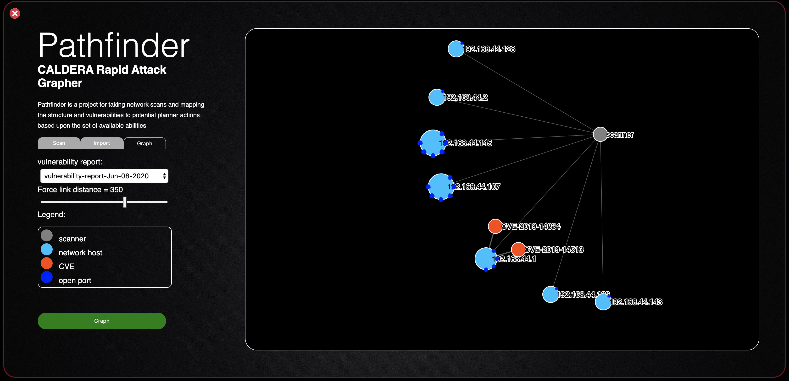

# CALDERA&trade; Pathfinder
A CALDERA plugin developed by the Center For Threat-Informed Defense to enable CALDERA to intelligently leverage vulnerability scan data in its operations. With Pathfinder, CALDERA can demonstrate how an adversary might use vulnerabilities in your environment to achieve their goals, highlighting a path through your network and showing the real impact of a vulnerability.  

###### map network vulnerabilities, plan network attacks

## Overview
Pathfinder seeks to extend the CALDERA automated adversary emulation platform to support automated ingestion of network scanning tool output for CALDERA to analyze and execute against. The principal objective of the project is to extend CALDERA to allow a user to do the following:
1. Run a scan of a target network or system
2. Upload the scan results to a running instance of CALDERA
3. Use the ingested results to draw out potential attack paths CALDERA could notionally take
4. Create workflows so that CALDERA can follow the actual attack paths and execute a real attack

More information is provided under [docs](https://github.com/center-for-threat-informed-defense/caldera_pathfinder/tree/master/docs)

## Questions and Feedback

Please submit issues for any technical questions/concerns or contact ctid@mitre-engenuity.org directly for more general inquiries.

Also see the guidance for contributors if are interested in [contributing.](https://github.com/center-for-threat-informed-defense/caldera_pathfinder/blob/master/CONTRIBUTING.md)

## Liability / Responsible Usage

This content is only to be used with appropriate prior, explicit authorization for the purposes of assessing security posture and/or research.

## Notice

Copyright 2020 MITRE Engenuity. Approved for public release. Document number CT0007

Licensed under the Apache License, Version 2.0 (the "License"); you may not use this file except in compliance with the License. You may obtain a copy of the License at

http://www.apache.org/licenses/LICENSE-2.0

Unless required by applicable law or agreed to in writing, software distributed under the License is distributed on an "AS IS" BASIS, WITHOUT WARRANTIES OR CONDITIONS OF ANY KIND, either express or implied. See the License for the specific language governing permissions and limitations under the License.
