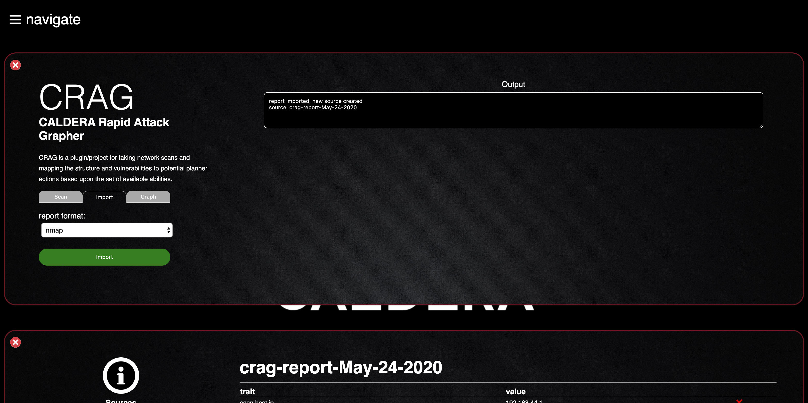

# CALDERA Pathfinder

A CALDERA plugin: https://github.com/mitre/caldera

Pathfinder is a plugin for mapping network vulnerabilities, scanned by caldera or
imported by a supported network scanner, and translating those scans into adversaries
for network traversal

